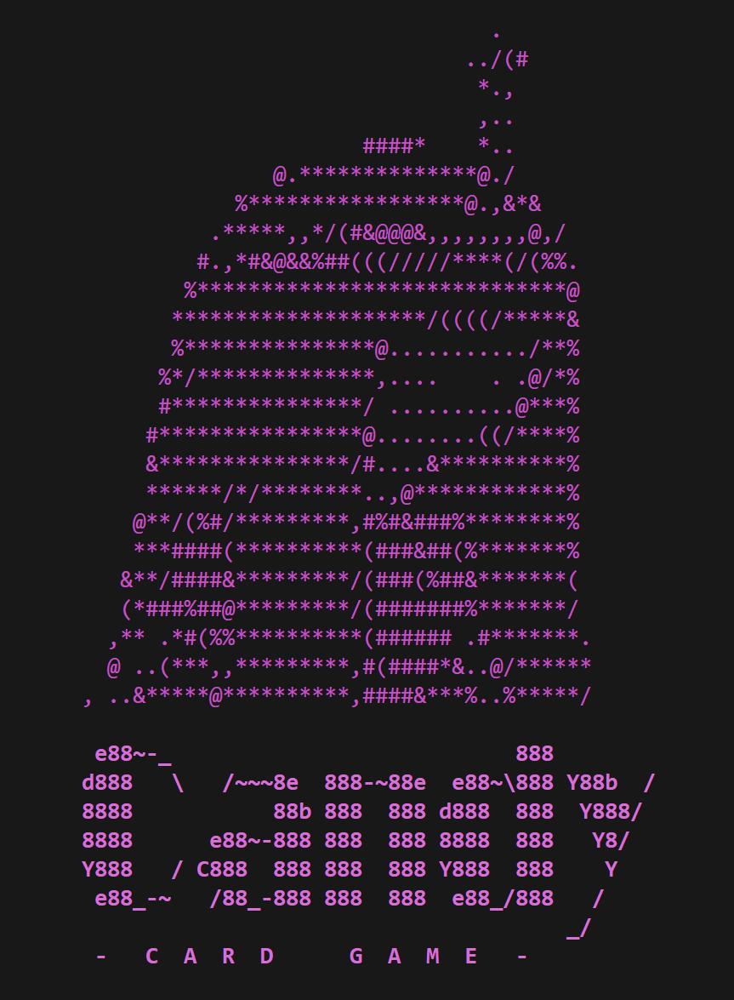

# Candy Card Game

> Source Code ini dibuat oleh kami, Kelompok LeLaH (LLH), untuk memenuhi Tugas Besar 1 Pemrograman Berorientasi Objek yaitu mengimplementasikan
> Kompetisi Kartu ala Kerajaan Permen menggunakan konsep Pemrograman Berorientasi Objek

## Daftar Isi
- [Anggota Kelompok](#anggota-kelompok)
- [Implementasi Program](#implementasi-program)
- [Sistematika File](#sistematika-file)
- [Requirements](#requirements)
- [Cara Menjalankan Program](#cara-menjalankan-program)
- [Screenshot](#screenshot)

## Anggota Kelompok
| NIM      | Nama                      |
| -------- | ------------------------- |
| 13521062 | Go Dillon Audris          |
| 13521084 | Austin Gabriel Pardosi    |
| 13521108 | Michael Leon Putra Widhi  |
| 13521160 | M. Dimas Sakti Widyatmaja |
| 13521172 | Nathan Tenka              |

## Implementasi Program
Dalam permainan ini, penulis mengimplementasikan berbagai konsep Pemrograman Berorientasi Objek, diantaranya sebagai berikut :
1. Inheritance dan Polymorphism
2. Exception dan Exception Handling
3. Function Overloading dan Operator Overloading
4. Abstract Class dan Virtual Function
5. Generic Function
6. Standard Template Library (STL)

Adapun konsep-konsep tersebut diimplementasikan dalam berbagai macam modul dasar yang dijelaskan sebagai berikut :
1. Command yang terdiri atas Kelas `Command` dan Kelas `AbilityCard`
2. InventoryHolder yang terdiri atas Kelas `InventoryHolder`, Kelas `Player`, Kelas `CardTable`, dan Kelas `DeckCard`
3. Score yang terdiri atas Kelas `Score`, Kelas `Combination`, Kelas `Card`, dan Kelas `Helper`
4. Game yang diimplementasikan pada Kelas `Game`
5. ExceptionHandling yang diimplementasikan pada Kelas `ExceptionHandling`, dan
6. Parsing yang diimplementasikan pada Kelas `Parsing`

## Sistematika File
```bash
.
├─── doc
├─── images  
├─── src
│   ├─── AbilityCard
│   ├─── Card
│   ├─── CardTable
│   ├─── Combination
│   ├─── Command
│   ├─── DeckCard
│   ├─── ExceptionHandling
│   ├─── Game
│   ├─── Helper
│   ├─── InventoryHolder
│   ├─── Parsing
│   ├─── Player
│   └─── Score
├─── test 
└─── README.md

```

## Requirements
- C++ 17 (diperlukan untuk menggunakan library filesystem)
- GCC compiler (versi 11.2.0 atau yang lebih baru)

## Cara Menjalankan Program
1. Pastikan GCC versi terbaru sudah terpasang pada mesin eksekusi (Anda dapat mengecek versi GCC dengan menjalankan *command* `gcc --version` pada *command prompt*).
2. Jalankan *command* `make all` pada *command prompt* untuk melakukan kompilasi pada program.
3. Jika proses kompilasi berjalan dengan baik, maka akan muncul *file* bernama `main`.
4. jalankan *command* `./main` untuk menjalankan program. Jika berhasil, maka Anda akan tiba pada program utama.

## Screenshot
